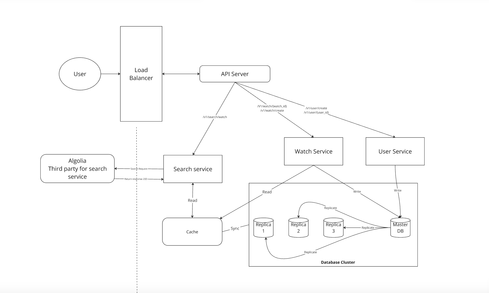

## A. Functional Requirements:
1. Create new watch model, with these input (name, brand, referenceNumber, retailPrice, currency, releaseDate).
2. Get the list of watches (including name and referenceNumber).
3. Filter models by brand.
4. Get the details of watch to see all detail information.
5. Edit watch information (except the name).
6. Pagination on the list of watches.
7. API documentation with swagger or similar tool.
8. Implementation protected routes for creating, updating, while allowing public access to retrieve watch information.
9. Write unit tests for the APIs.
10. Implement search functionality to find watches by name or reference number.

## B. Non-functional requirements:
1. Security, using Authentication and authorization to make sure the APIs is secure.
2. Logging, we need logging because:
    - To call attention to errors or add context before crashing, 
    - Help us to tracing of program execution,
    - Capture potentially problematic state in warning
3. Error Handling is crucial here.
4. Documentation, will be helpful to let other devs understanding the system.
5. Can we add caching here for search feature?

## C. API Layer:
### POST
| Endpoint Name      | Input                                                                           |
|--------------------|---------------------------------------------------------------------------------|
| /v1/users/register    | name, email, passsword                                                          |
| /v1/user/login | email, password |
| /v1/currency/create| name, code, countryId, symbol                                                   |
| /v1/watch/create   | name, brandId, referenceNumber, retailPrice, currencyId, countryId, releaseDate |
| /v1/brand/create   | name, countryId                                                                 |
| /v1/country/create | name,                                                                           |

### GET
| Endpoint Name     | Params                                        |
|-------------------|-----------------------------------------------|
| /v1/watch/params  | brand, example: /v1/watch/brand=Rolex         |
|                   | name, example: /v1/watch/name=Submariner      |
|                   | referenceNumber, example: /v1/watch/1234      |
| /v1/watch/{id}    | watchId, example: /v1/watch/1                 |
| /v1/watch/list    | NA                                            |
| /v1/brand/{id}    | brandId, example: /v1/brand/1                 |
| /v1/brand/list    | NA                                            |
| /v1/country/{id}  | countryId, example: /v1/country/1             |
| /v1/country/list  | NA                                            |
| /v1/currency/{id} | currencyId, example: /v1/currency/1           |
| /v1/currency/list | NA                                            |
| /v1/users/{id} | userId, example: /v1/users/1           |
| /v1/users | NA                                            |
| /v1/users/my-profile | JWT_auth_token |

### PUT
| Endpoint Name      | Params                                                                    |
|--------------------|---------------------------------------------------------------------------|
| /v1/users/:id       | name, email                                                               |
| /v1/currency/:id   | name, code, countryId, symbol                                             |
| /v1/watch/:id      | brandId, referenceNumber, retailPrice, currencyId, countryId, releaseDate |
| /v1/brand/:id      | name. countryId                                                           |
| /v1/country/:id    | name                                                                      |

## D. Database Layer
| User Table |                                     |
|------------|-------------------------------------|
| id         | userId AS UUID PRIMARY KEY NOT NULL |
| name       | VARCHAR                             |
| email      | VARCHAR NOT NULL                    |
| password   | VARCHAR NOT NULL                    |
| createdAt  | Timestamp                           |
| updatedAt  | Timestamp                           |
| deletedAt  | Timestamp                           |

| Watch Table     |                                                                             |
|-----------------|-----------------------------------------------------------------------------|
| id              | UUID PRIMARY KEY NOT NULL                                        |
| name            | VARCHAR NOT NULL                                                            |
| brandId         | UUID REFERENCES brands(id) ON DELETE SET NULL,  -- Link to Brand table      |
| referenceNumber | VARCHAR NOT NULL UNIQUE                                                     |
| retailPrice     | BIGINT NOT NULL                                                             |
| currencyId      | UUID REFERENCES countries(id) ON DELETE SET NULL|
| releaseDate     | DATE NOT NULL                                                             |
| countryId       | UUID REFERENCES countries(id) ON DELETE SET NULL,  -- Link to Country table |
| createdAt       | Timestamp                                                                   |
| updatedAt       | Timestamp                                                              |           

| Brand Table   |                                                       |
|---------------|-------------------------------------------------------|
| id            | UUID PRIMARY KEY                           |
| name          | VARCHAR NOT NULL                                      |
| originCountry | UUID REFERENCES countries(id) ON DELETE SET NULL |
| createdAt     | Timestamp                                             |
| updatedAt     | Timestamp                                             |
| deletedAt     | Timestamp                                             |

| Country Table |                               |
|---------------|-------------------------------|
| id            | UUID PRIMARY KEY |
| name          | VARCHAR NOT NULL              |
| code          | VARCHAR NOT NULL              |
| createdAt     | Timestamp                     |
| updatedAt     | Timestamp                     |

| Currency Table |                                |
|----------------|--------------------------------|
| id             | UUID PRIMARY KEY |
| name           | VARCHAR(100) NOT NULL          |
| code           | VARCHAR (10) NOT NULL UNIQUE   |
| countryId | UUID REFERENCES countries(id) ON DELETE SET NULL,  -- Link to Country table |
| symbol         | VARCHAR (10)                   |
| createdAt      | Timestamp                      |
| updatedAt      | Timestamp                      |

## D. Deep Dive
The main focus of this API is the Search catalogue feature, lets do estimation below:
### Estimate:
1. Daily Active User 1 Millions 
2. Average number of watches added per day 1,000 watches / day 
3. Average number of watches size (include image): 500 kb 
4. Yearly Watches storage 1,000 Watches * 360 days * 500 kb = 182,5 GB 
5. Proximity Search 3 queries per user * 1,000,000 users = 3 millions queries/day 
6. Read Per second 3 millions read per day / (24 hours * 3600 seconds) = 34,72 reads/seconds

### Solution
Usually to improve the search feature, there is a few solution we can do:
1. **Caching,**  
   Redis is the most popular caching, while for this case, 
   i notice NestJs having their own caching feature, we can use the NestJs caching module.
   So, for caching we have 2 options here, 
   1. **using Redis combine with NestJs built-in cache**
      - pros: costly saving,
      - cons: might need more budget for Redis
   2. **using NestJs Built-in caching.**
      - pros: Simple to set up, no external dependencies, cost-effective for small-scale apps 
      - cons: Limited scalability (in-memory), may not handle high traffic or horizontal scaling well
2. **Database Indexing**   
   - Pros: Improves query performance for searches on specific columns (e.g., watch name, brand, etc.)
   - Cons: Indexes can slow down writes, more storage required    
   another solution if we want to use Database indexing, 
   Actually we can just *create a new table specialized for read* that contains data specialized for read. However, this solution have their own pros and cons as well. 
   Here is the pros and cons below:     
    - Pros: Optimized for reading, main table won't be impacted by indexing when doing write and update, more flexible because we can apply complex indexing here.
    - Const: Might need more larger storage space and not suitable for handling large data set, might lead to data duplication because we keep the copy of the data.
3. **Algolia**   
    Algolia is a hosted search service designed to provide fast and scalable search functionality with minimal setup.
      - Pros: Fast search, full-text search capabilities, and advanced filtering; managed service
      - Cons: Additional cost, less control over infrastructure
4. **Elasticsearch**  
    Being used by most Big companies to handle large scale of data and support complex search-queries
   - Pros: Highly scalable, powerful full-text search, and analytics; distributed 
   - Cons: Complex setup, maintenance, and higher infrastructure cost

## E. High Level Design

### We need Database Replication because:
1. **Highly availability**,  by replicating the DB across different locations, even though the master DB are down, we still can access the data stored in another database server.
2. **Reliability**, If one of the DB are destroyed, data will still preserved. We don't need to worry about data loss, because of the data is replicated across multiple locations.
3. **Better Performance**, All writes and read are happen in Master DB, meanwhile for read operations are distributed across replica DB. 
This model improves performances because it allows more queries to processed  in parallel.

### End-to-end flow summarized
1. **User sends a request** (e.g., search or CRUD operation) -> **Load Balancer** routes the request to the **API Server**.
2. **API Server checks the Cache**:
   - **Cache Hit**: Return cached response.
   - **Cache Miss**: Forward request to the **Search Service** or **Database Cluster**.
3. If search:
   - **Search Service** queries **Algolia** or **Database** and updates the cache.
4. If CRUD operation:
   - **Watch Service** or **User Service** writes data to the **Master DB**, which syncs with replicas.
5. **API Server returns the response** to the user.
